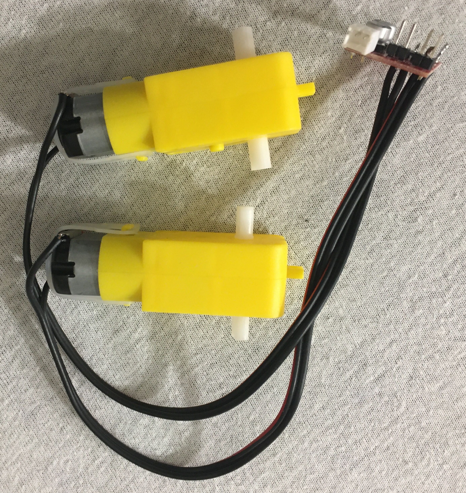
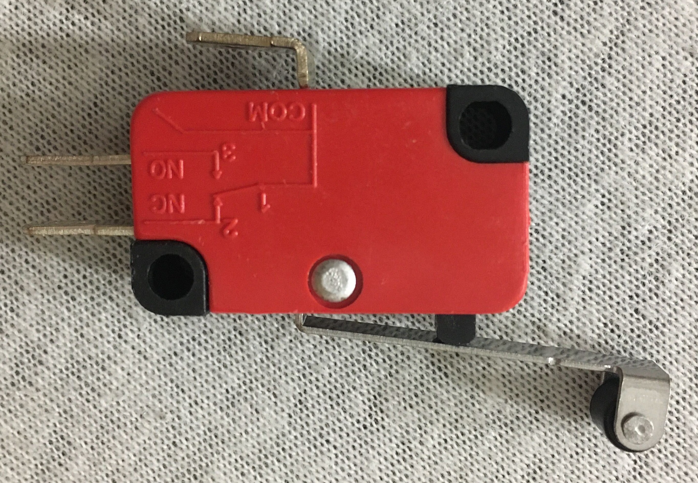

============================================
Technické info, ovládanie a popis robota
============================================

Názov "robot" pre to, čo máte urobiť je možno trochu zavádzajúci,
keďže robot nemusí vedieť urobiť všetko sám.
Rátame s tým, že ho budete ovládať na diaľku.
Samozrejme, to Vám ale nebráni naprogramovať si akúkoľvek automatizáciu, čo len chcete.

.. _suciastky:

Súčiastky
----------

Podrobnejšie informácie o súčiastkách a o spôsobe ich zapojenia sú opísané v časti :doc:`schemas`.

Riadiaca jednotka
~~~~~~~~~~~~~~~~~~~~~~~
Ako "počítač" pre robota bude slúžiť jedno ESP32 (je to v zásade nejaký klon Arduina).
Oproti bežnému arduinu je táto doska vybavená WiFi a Bluetooth.
Táto doska sa programuje v rovnakom jazyku ako Arduino (jazyk podobný C/C++).

Motory a ich ovládanie
~~~~~~~~~~~~~~~~~~~~~~~
K dispozícii máte 2 motory aj s ich riadiacou jednotkou.
Táto riadiaca jednotka (motor driver) vie ovládať 2 motory, každý z nich obomi smermi.

Vstupné senzory
~~~~~~~~~~~~~~~~~~~~~~~
K dispozícii máte 4 senzory čiary a 4 mikrospínače.
Senzory čiary vracajú informáciu, či je pred nimi čiara, alebo nie.
Presnejšie, vracajú digitálnu hodnotu,
či je odrazené svetlo väčšie ako nejaká prahová hodnota.
Táto hodnota je nastavovaná trimrom, ktorý je na senzore.

Tiež máte k dispozícii 4 mikrospínače, pomocou ktorých viete zisťovať dotyk s prekážkou.

Šasí a stavebné prvky
~~~~~~~~~~~~~~~~~~~~~~~
Na stavbu tela robota dostanete niekoľko súčiastok s M3 dierami.
Dostanete rovné "dosky".
Na pripájanie súčiastok na dosky, resp. dosiek medzi sebou dostanete "Lká" a "Tčka",
a rovné diely, tiež s M3 dierami.
Väčšina súčastok má M3 alebo M2.5 dieru, takže to je odporúčaný spôsob ich spájania.
Máte k dispozícii dlhé a krátke M3 šrouby, veľkoplošné podložky, matky a zopár samoistných matiek.

Napájanie
~~~~~~~~~~~~~~~~~~~~~~~
Celý robot bude napájaný jednou jednočlánkovou Li-Ion baterkou.
Túto baterku zvláda dobíjať samotné espčko v prípade,
že je zároveň pripojené usb káblom k zdroju napätia.

.. _ovladanie:

Ovládanie robota
-----------------
Na espčku, ktoré je na robotovi je spustený webserver.
Po pripojení sa na tento server cez (napr.) mobil sa načíta stránka,
pomocou ktorej je možné ovládať robota.
Od robota do pripojeného zariadenia (mobilu) sú posielané informácie o tom,
ako robot nastavil nejaký výstup, rôzne pomocné výpisy,
pomocou ktorých môžete robota ladiť a tiež aj informácie zo vstupných senzorov (čiary alebo dotyku).

Akékoľvek ovládanie robota je schválne mierne oneskorené,
aby dávalo zmysel programovať si vlastné automatizované funkcie.