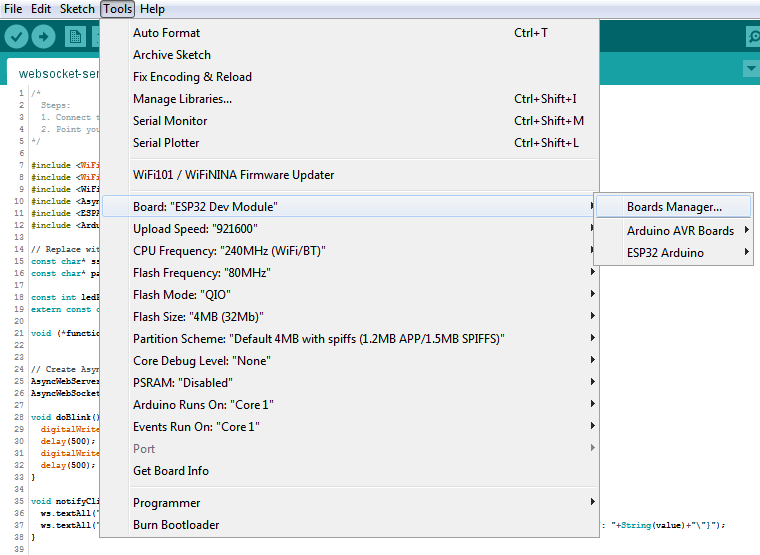
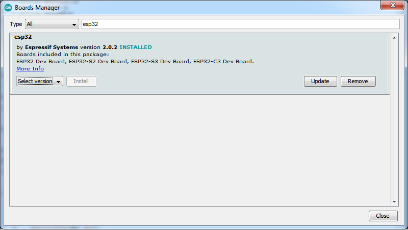
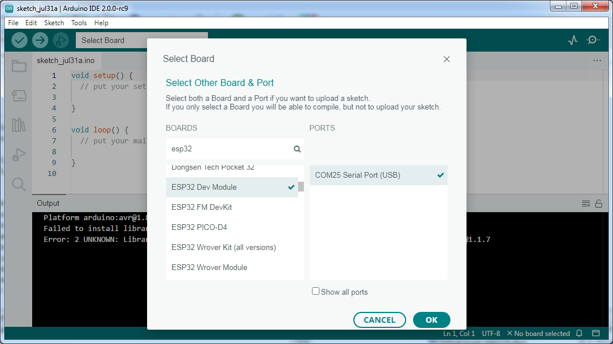
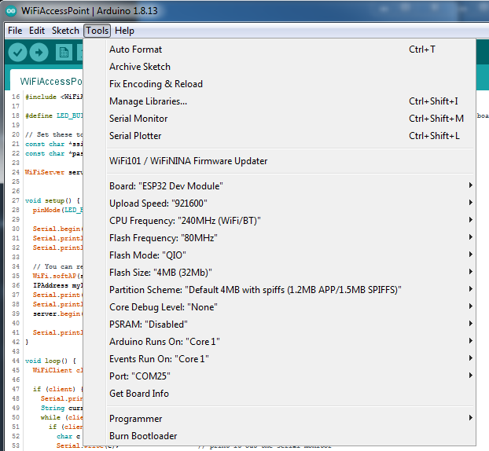

============================================
Prvý program, nastavenie IDE
============================================

V tejto časti opíšeme to, ako nastaviť Arduino IDE, ktoré knižnice si stiahnuť a tak,
ako spustiť prvý program a vôbec, ako programovať niečo pre ESPčko.

.. _ide:

Arduino IDE
------------

Na programovanie ESPčka budeme používať Arduino IDE.
Stiahnuť si ho môžete napríklad `na oficiálnej stránke Arduina <https://www.arduino.cc/en/software>`__.
Marcel používal v1.8.19, Krto sa nebál pre-released v2.0, asi je to na vás.

Najprv si potrebujete nainštalovať ESP32 dosku a knižnice.

Inštalácia ESP32 dosky
~~~~~~~~~~~~~~~~~~~~~~~~

Otvorte si Board Manager. Pre v1.* vyzerá zhruba takto:

a počkajte, kým si dotiahne updaty z internetu.

Následne dajte hľadať dosku `esp32` a nainštalujte si ho.
Marcelovi fungovala iba v2.0.2, s novšími mal problémy.

Verzia 2.0 by ho mala otvoriť hneď na začiatku a teda vyberiete ESP32.

Inštalácia potrebných knižníc
~~~~~~~~~~~~~~~~~~~~~~~~~~~~~~~~~

Potrebujete si stiahnuť tieto knižnice:

* `ESPAsyncWebServer <https://github.com/me-no-dev/ESPAsyncWebServer.git>`__. Je tiež aj :download:`v tomto repozitári <../../libs/ESPAsyncWebServer-master.zip>`.
* `AsyncTCP <https://github.com/me-no-dev/AsyncTCP.git>`__ Je tiež aj :download:`v tomto repozitári <../../libs/AsyncTCP-master.zip>`.
* ArduinoJson. Táto knižnica sa dá stiahnuť cez Library Manager a nemusíte ju sťahovať ako `.zip`.
  
  .. figure:: images/arduinoJson.png
  
  Vľavo pre v2, vpravo pre v1.*

A v prípade, že sa vám nepodarí spustiť kód pre ESP32, a bude vám hlásiť,
že to nepozná `analogWrite`, tak potrebujete si ešte stiahnuť knižnicu na `analogWrite`,
`napríklad túto <https://github.com/erropix/ESP32_AnalogWrite.git>`__.
Tiež je stiahnutá `v tomto repozitári <../../libs/ESP32_AnalogWrite-master.zip>`__.

Nastavenie dosky
~~~~~~~~~~~~~~~~~~~~~~~

Pre nás fungovalo nasledovné nastavenie dosky:

Malo by stačiť nastaviť správny `Board` na `ESP32 Dev Module` a zvyšok sa nastavil sám.
Budete si musieť nastaviť `Port` na ten, kde bude ESPčko reálne pripojené
(proste vám to ponúkne zhruba jedinú možnosť a vy u vyberiete).