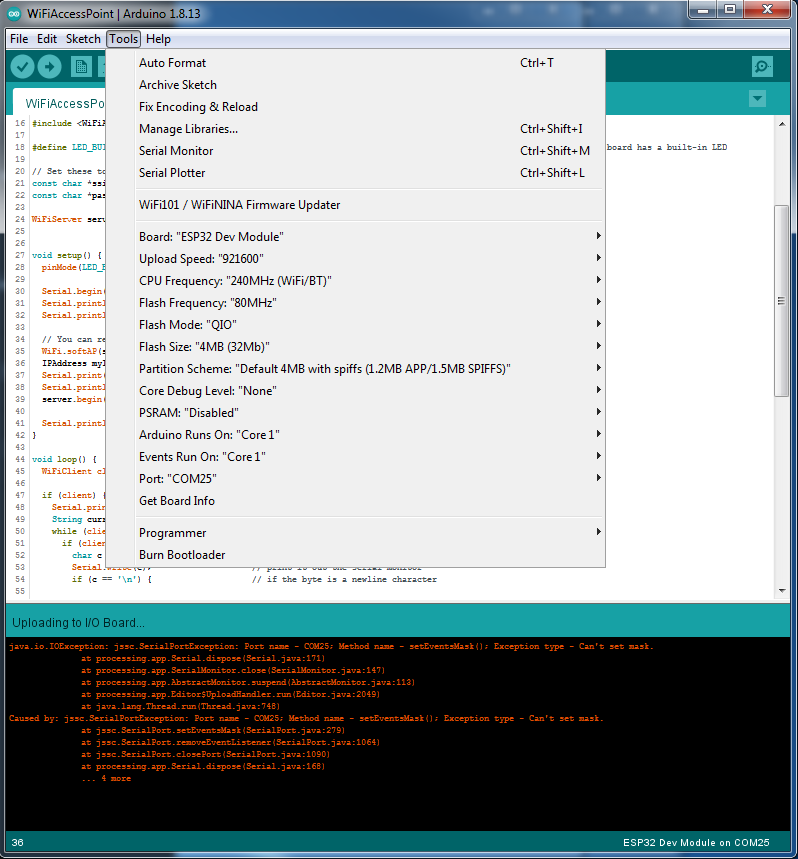

============================================
Prvý program, nastavenie IDE
============================================

V tejto časti opíšeme to, ako nastaviť Arduino IDE, ktoré knižnice si stiahnuť a tak,
ako spustiť prvý program a vôbec, ako programovať niečo pre ESPčko.

.. _ide:

Arduino IDE
------------

Na programovanie ESPčka budeme používať Arduino IDE v2.

Najprv si potrebujete nainštalovať ESP32 dosku a knižnice.

Knižnice:

* `ESPAsyncWebServer <https://github.com/me-no-dev/ESPAsyncWebServer.git>`__. Je tiež aj :download:`v tomto repozitári <../../libs/ESPAsyncWebServer-master.zip>`.
* `AsyncTCP <https://github.com/me-no-dev/AsyncTCP.git>`__ Je tiež aj :download:`v tomto repozitári <../../libs/AsyncTCP-master.zip>`.

Nastavenie dosky
~~~~~~~~~~~~~~~~~~~~~~~

Pre nás fungovalo nasledovné nastavenie dosky:

Malo by stačiť nastaviť správny `Board` na `ESP32 Dev Module` a zvyšok sa nastavil sám.
Budete si musieť nastaviť `Port` na ten, kde bude ESPčko reálne pripojené
(proste vám to ponúkne zhruba jedinú možnosť a vy u vyberiete).