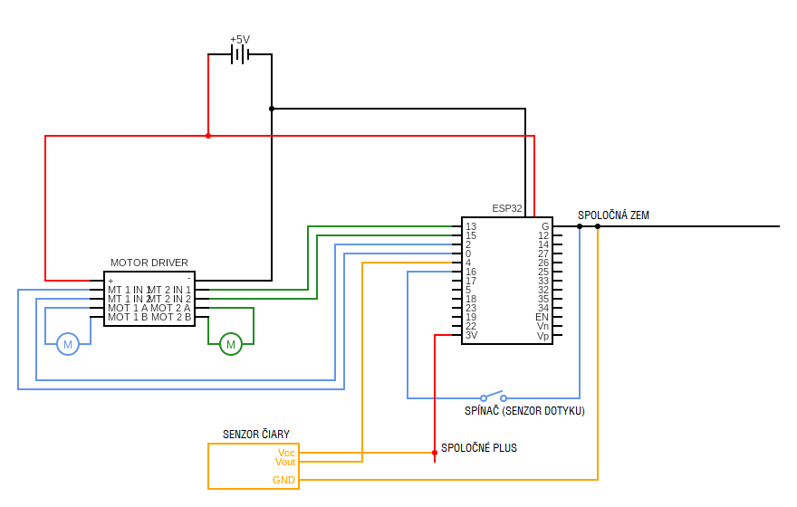
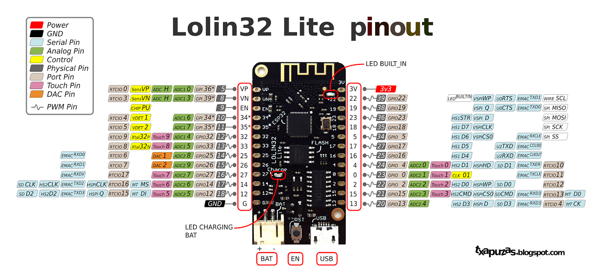
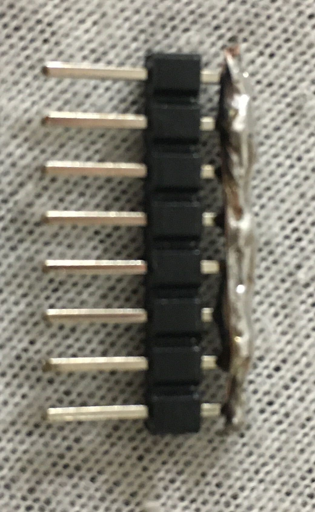
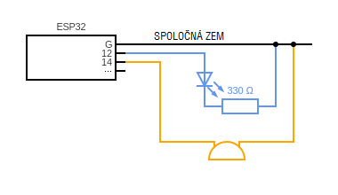

=================
Schémy zapojenia
=================

Ukážková schéma zapojenia je tu:

.. note::
   
   Všeobecné rady ku káblovaniu:
   
   * ak naozaj neviete čo robíte, tak neprepájajte káble kým sú pod napätím.
     Nie že by sa Vám malo niečo stať (je to iba 5V),
     ale môže sa Vám stať, že sa dotknete odizolovaným káblom niečoho,
     čo zoskratujete, a zničíte tým tú súčiastku (a veľa náhradných nemáme :D)
   * ak niečo začne smrdieť ako spálený plast alebo dymiť, tak odpojte baterku :D 
   * v kľude si po sebe skontrolujte to, čo ste zapojili
   * v prípade, že chcete niečo zapojiť inak ako je tu popísané,
     tak to radšej najprv skonzultujte s vedúcimi

Motory
~~~~~~~~

V ľavej časti schémy je obvod, ktorý slúži na ovládanie motora.
K tomuto obvodu sú pripojené oba motory (káble k motorom už máte napájkované).
Do tohoto obvodu sa pripája priamo baterka.
Každý motor je ovládaný dvomi vstupnými pinmi. 
Tieto piny sa k ESPčku pripájajú káblami samica-samica.

Technické detaily (ak nepochopíte, nevadí):
Ak je na jeden z nich pripojené vstupné napätie, tak sa motor točí na jednu stranu, ak na druhý,
tak na druhú -- pomerne priamočiare. Čím menšie napätie je na vstupe, tým pomalšie sa točí.

.. warning::

   Vyhnite sa tomu, že bude na oba piny ovládania pripojené nenulové napätie,
   keďže tým môžete zoskratovať motor driver. (Možno je voči tomu odolný, ale neskúšali sme to).
   
   Najjednoduchší spôsob, ako sa tomu vyhnúť je ovládať motor pomocou našich funkcií.
   
   Motor driver by mal ostať počas celého používania v zásade studený, takže ak je teplý až horúci,
   tak asi máte niečo zle zapojené, najpravdepodobnejšie sú to skratované prívodné káble k motorom.
   Možno sa odlomili, alebo také niečo.

Senzor čiary
~~~~~~~~~~~~~~~~

Tento senzor funguje tak, že má dve ledky.
Jedna z nich svieti a druhá svetlo prijíma (a zisťuje, že koľko svetla prijala).
Ak tento senzor svieti pred robota na zem, ktorá je celá biela,
tak sa pomerne veľa svetla odrazí naspäť.
V prípade, že je pred senzorom zem čierna, tak sa naspäť odrazí len pomerne málo svetla.

Tento senzor teda robí to, že v prípade, že je množstvo svetla,
ktoré ledka prijíma menšie ako nejaká hranica, tak vráti na výstup hodnotu 0 (0V),
inak vracia hodnotu 1 (vstupné napätie).
Aká presne je táto hranica sa dá nastaviť trimrom (potenciometrom), ktorý je na každom senzore.

Baterka
~~~~~~~~

Baterka má dva identické konektory, jeden sa pripája do ESP32 a druhý do motor drivra.
Konektory sú asymetrické, takže by ich nemalo byť možné zapojiť opačne.

.. warning::

   Baterku neprepichujte, neohýbajte, nerežte a také. Nemusí aj toto LTT skončiť zhorenou rukou.
   
   Tiež v prípade, že baterka začne byť horúca, alebo sa začne nafukovať,
   tak ju prestaňte používať, a povedzte nám o tom.
   
   .. figure:: images/nafuknuta-baterka.png
   
   Naľavo príklad nafúknutej baterky.
   
.. _dotyk:
   
Senzor dotyku (spínač)
~~~~~~~~~~~~~~~~~~~~~~~~

Ako senzor dotyku slúži mikrospínač, na ktorý je pripevnená páka s kolieskom,
aby sa spoľahlivo pri dotyku stlačil.

Na pripojenie spínača k ESPčku máte zopár káblov, ktoré majú na jednom konci
4,8mm faston konektor a na druhom samicu, ktorá pasuje na piny ESPčka.

Mikrospínač je v zásade prepínač, ktorý má 3 piny (nazvime ich stredný a dva krajné).
V prípade, že nie je vypínač stlačený, tak je stredný pin prepojený (spojený) s jedným krajným.
Po stlačení sa stredný pin pripojí (spojí) s opačným krajným pinom
a odpojí sa od toho, ku ktorému bol pripojený doteraz.
Schematicky je to pomerne pekne znázornené na boku vypínača.

Spínač je teda zapojený tak, že po stlačení spojí (resp. rozpojí) zem so vstupným pinom ESPčka.

ESP32
~~~~~~~~

Z vrchnej časti je konektor na USB, ktorým prepájate ESPčko s počítačom.
Vedľa neho je reset tlačítko - to reštartuje ESPčko, teda sa program,
ktorý je na ňom nahratý začne vykonávať od začiatku
(rozbehnutie servera a wifi môže po reštarte trvať približne 30s).
Vedľa neho sa nachádza napájací konektor, na pripojenie baterky.

Po obvode sa nachádza veľa™ pinov.
Väčšina z nich je vstupno-výstupná, teda týmto pinom môžete niečo ovládať (výstup),
a z tohoto pinu môžete čítať napätie (vstup).
Takmer všetky piny môžu ovládať výstup nie len digitálne (vypnuté(0V)/zapnuté(3V)),
ale aj analógovo (0-3V).

Pinout ESP32. Piny, ktoré sú označené ako PWM môžu byť ovládané aj analógovo.

Na ESPčkach máte napájkovanú len zhruba polovicu nožičiek.
V prípade, že by vám tento počet nestačil, môžete si dopájkovať aj vlastné,
ale príďte nám to povedať (minimálne preto, že máme pájkovačku :D).

Spoločné plus a mínus(zem)
~~~~~~~~~~~~~~~~~~~~~~~~~~~~~~~~

Keďže je pomerne veľa súčiastok sa pripája na plus a mínus(zem) (senzory čiary a vypínače),
tak máte vyrobený "rebrík", na ktorý viete pripojiť mínus(zem)
alebo plus z ESPčka a následne na tento rebrík popripájať všetko čo potrebujete.

Prepájanie súčiastok
~~~~~~~~~~~~~~~~~~~~~~~~~~~~~~~~

Máte k dispozícii káble samica-samica na prepájanie takých pinov ako sú na ESPčku.
Potom máte káble, ktoré majú na jednom konci 4,8mm faston konektor a na druhom samicu,
ktorá pasuje na piny ESPčka (na prepájanie :ref:`mikrospínačov z ESPčkom <dotyk>`).

Ak by ste potrebovali nejaké káble pripájkovať, alebo ste mali málo káblov,
tak máme pájkovačku/y.

Bez dovolenia vedúcich káble nestrihajte, nech už by ste chceli robiť čokoľvek.

.. _led:

LEDky a pípač
~~~~~~~~~~~~~~~~~~~~~~~~~~~~~~~~

V prípade, že chcete, môžete použiť aj niekoľko LEDiek a pípač.
Schéma zapojenia je pomerne jednoduchá:

.. warning::

   LEDku zapájajte vždy s odporom, a nikdy nie bez neho, lebo môžete ESPčko skratovať.
   
LEDku viete ovládať aj digitálne (0/1), aj analógovo.
Pri pípači viete trochu meniť tón a zároveň hlasitosť tak, že ho ovládate analógovo.